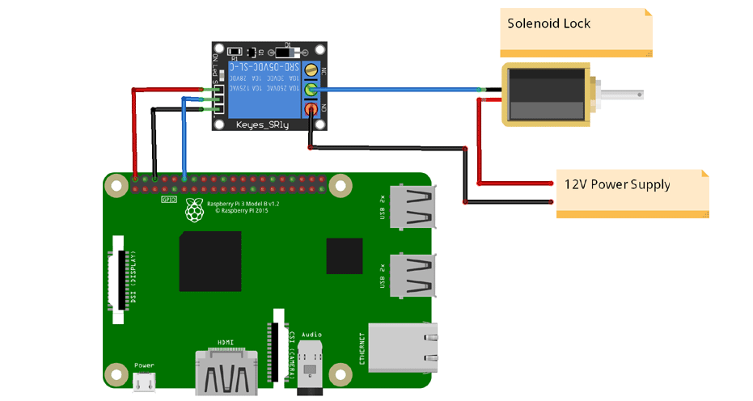

# Raspberry Pi 4 Facial Recognition

ssh -Y pi@raspberrypi.local ( commande pour lancer raspberrypi)

(pass: raspberry)
workon cv

Documentation: GPIO Raspberry Pi: https://www.raspberrypi.org/documentation/usage/gpio/

Face recognition:
                  mkdir dataset  
                  python data.py ( for get image to dataset) 
                  python trainer.py ( train model) 
                  python recognition.py (to detect) 

https://maker.pro/raspberry-pi/projects/raspberry-pi-fingerprint-scanner-using-a-usb-to-serial-ttl-converter ( connect TTL converter and Fingerprint sensor)

Installation of the Raspberry Pi Fingerprint Library: 
sudo bash 
wget -O - http://apt.pm-codeworks.de/pm-codeworks.de.gpg | apt-key add -  
wget http://apt.pm-codeworks.de/pm-codeworks.list -P /etc/apt/sources.list.d/  
apt-get update  
apt-get install python-fingerprint --yes 
If an error has occurred: apt-get -f install 

Save and manage fingerprint: 
python /usr/share/doc/python-fingerprint/examples/example_enroll.py ( get data) 
python /usr/share/doc/python-fingerprint/examples/example_search.py (see whether finger is recognized, position of fingerprint) 
python /usr/share/doc/python-fingerprint/examples/example_delete.py ( delete fingerprint with number of position) 
python /usr/share/doc/python-fingerprint/examples/example_downloadimage.py (download fingerprint image) 

commande line: ssh -N -L localhost:8000:localhost:8000 pi@raspberrypi.local : connect localhost 8000 of Raspberry Pi to local machine ( laptop)

